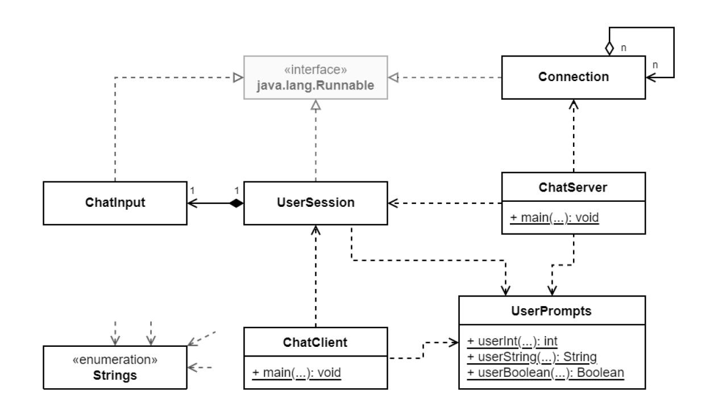

# socket-api-chat
A fully command-line based multi-user chat solution based on the Java Socket API. Network Technologies coding assignment as an SD student at GMIT, handed in in January 2022.

## MAIN FEATURES
	
Compile the source code (Java 1.8 or newer) and run “java ie.gmit.dip.ChatServer” to start the server, or “java ie.gmit.dip.ChatClient” to run the client. Follow the on-screen instructions. Try typing “/who” and “/me likes this implementation!” while chatting.

## DESIGN NOTES

	
### ChatServer

Prompts the user to enter port number; instantiates a ServerSocket; starts a local user session in a separate thread; until the local session ends, starts a Connection thread for each new Socket in a cached thread pool; then, terminates any connections, as well as the thread pool, and closes the server socket. User can either start over or exit.

### ChatClient

Prompts the user to enter hostname and port, then starts a local user session in a separate thread. Waits until user session has ended and catches any exceptions on the way. User can either start over or exit.

### Connection

A Runnable executed for each new server-client connection by the server. Each instance has a thread-safe list of all its ChatServer’s connections. While connected, uses its Socket’s input stream to listen for messages sent by the client and either respond to commands like “/q” or “/who” individually or broadcast the message to all clients via the output stream of each Connection’s Socket.

### UserSession

A Runnable executed for each new server-client connection by the client. Prompts for username, then starts a dedicated ChatInput in a separate thread, then uses the Socket’s input stream to print out broadcasted messages or any responses to chat commands. Has a post method that reacts to some commands (like “/q”) and generally dispatches messages from ChatInput through the Socket’s output stream. Terminates its ChatInput before shutting down.

### ChatInput

A Runnable executed for each new server-client connection by the client’s UserSession. Because each UserSession has exactly one ChatInput that lives and dies with it, ChatInput is implemented as a private inner class of UserSession. While running, buffers the user’s input and calls the UserSession’s post method whenever the user presses Enter after having typed something beyond white spaces. Care needs to be taken to avoid blocking due to methods such as readLine/nextLine. The input stream is read byte by byte to avoid any related issues such as invisible input etc.

### UserPrompts

Helper class with static methods for getting primitive types through the console. Static import where needed.

### Strings

Enum with hard-coded strings and methods to do with their display (colours and such) to keep the code clean. Static import where needed.

## REFERENCES

Strings.clearConsole() is not my work, it can be found [here (link contains minor errors)](https://www.delftstack.com/howto/java/java-clear-console/). 
